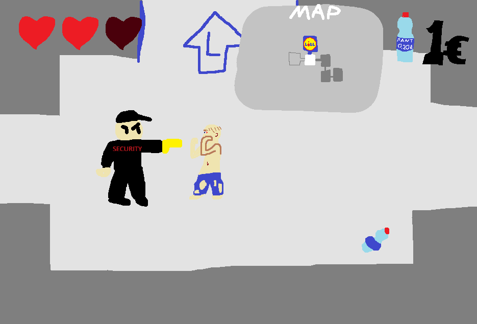

# Harjoitustyön suunnitelma

## Tietoja 

Tekijä: Eeli Eskola

Työ git-varaston osoite: <https://github.com/zfhp/ohj1ht>

Pelin nimi: Lost In Forum

Pelialusta: Windows

Pelaajien lukumäärä: 1

## Pelin tarina

Olet koditon mies Jyväskylän Forum - kauppakeskuksessa. Olet sekavassa mielentilassa ja et löydä uloskäyntiä. Tehtäväsi on kerätä rahaa pullopanteista ja tavaroita, päihittää vihollisia kuten asiakkaat ja turvamiehet ja lopulta löytää uloskäynti.

## Pelin idea ja tavoitteet

Pelin ideana on olla ylhäältä katsotusta perspektiivistä pelattava dungeon crawler roguelite, jossa on satunnaisesti luodut kartat. Karttojen olisi tarkoitus koostua huoneista, joissa on joko vihollisia tai esimerkiksi kauppa tai aarteita. Tavoitteenani on saada aikaiseksi toimiva kartan satunnainen luonti, muutama erilainen vihollinen ja paljon erilaisia tavaroita, joita voi hyödyntää pelissä. Teen luultavasti ohjelman, jolla luon valmiiksi huoneita json-tiedostoina, joista ohjelma valitsee satunnaisesti.

## Hahmotelma pelistä

## Toteutuksen suunnitelma

Helmikuu

- Pelaaja ja pelaajan liikkuminen
- Viholliset
- Kerättäviä tavaroita

Maaliskuu

- Kartan satunnainen luonti ja huoneiden luomis ohjelma
- Menut ja UI
- Toimiva peli

Jos aikaa jää

- Minimap
- Tarina pelissä
- Bossfight
